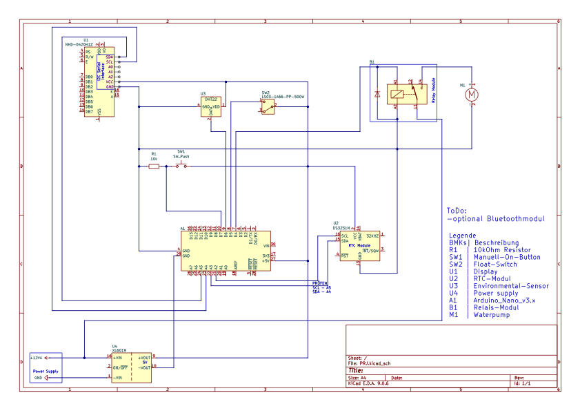

# Hydroponic_Tower_Automation
Hier finden Sie eine detaillierte Anleitung, um einen modularen Hydroponikturm zu automatisieren. Die Anleitung enthält einen Schaltplan, den Code der Software, eine Liste der benötigten Materialien und eine Schritt-für-Schritt-Anleitung.

TODO:

## 3D-Druck
**Grundaufbau:** 
Zunächst werden die benötigten, modularen Komponenten für den Hydroponikturm mit einem 3D-Drucker gedruckt. Als Basis für unser Projekt haben wir die Designs von Luitzor verwendet, die unter der folgenden URL verfügbar sind: [Luitzor's Hydroponic Tower Designs](https://www.thingiverse.com/thing:5712775). Wir empfehlen, diese Designs als Ausgangspunkt zu verwenden, da sie bereits sehr gut durchdacht, modular und funktional erweiterbar sind.

Wir haben die Designs auf 75 % der Originalgröße skaliert, da wir in unserem Fall einen kleineren Turm automatisieren wollten, der auch auf einem Schreibtisch, einer Fensterbank oder ähnlichen begrenzten Flächen Platz findet. Damit das Druckergebnis optimal wird, empfehlen wir die folgenden Druckeinstellungen:

- Material: Extrudr PET-G (lebensmittelecht)
- Drucker: Bambu Lab X1C 
- 0.16mm Optimal @BBL X1C mit folgenden Anpassungen:
    - Fülldichte: 25 % (Gyroid)

Mindestens sollten die folgenden Komponenten gedruckt werden:
- 1x 4-Way_Planting_Module_Hollow_Twist.STL
- 4x Standard_Pot_02_For_4-5-Way_Planting_Module.STL
- 1x Module_Spacer_40mm.STL
- 1x Dispenser_Module_Internal.STL
- 1x IKEA_Muskot_24cm_Lid.STL
- 1x Lid_Without_Holes.STL
- 1x Pump_Cap.STL
- 1x Pump_Cap_Symbol.STL
- 1x Filling_Cap.STL
- 1x Filling_Cap_Symbol.STL

Soll der Turm mehrere Ebenen haben, wozu wir raten, müssten sie pro Ebene einmal `4-Way_Planting_Module_Hollow_Twist.STL`, viermal `Standard_Pot_02_For_4-5-Way_Planting_Module.STL` und einmal `Module_Spacer_40mm.STL` drucken. Der Abstandhalter `Module_Spacer_40mm.STL` ist nicht zwingend notwendig, aber wir empfehlen ihn, um den Pflanzen mehr Platz zum Wachsen zu geben. Außerdem empfehlen wir mehrere Pflanzenpods `Standard_Pot_02_For_4-5-Way_Planting_Module.STL`, als Reserve zu drucken, falls eine Pflanze nicht gedeiht oder ersetzt werden muss.

**Unsere 3D Files**:
Zur sicheren Unterbringung der Elektronik, haben wir ein Gehäuse und Platinenhalterungen designed. Diese Dateien finden Sie im Ordner `3D_Designs`. Sie benötigen die folgenden Dateien jeweils einmal:
- Vertical_Gardening_Housing.stl
- Vertical_Gardening_Housing_Lid.stl
- Sockelhalter_Platine_Main.stl
- Sockelhalter_Relais.stl

**Kalkulation:** 
In der Datei `3D_Berechnung.xlsx` können Sie vorab kalkulieren, wie viel Filament für den Druck der benötigten Komponenten in Abhängigkeit zur Anzahl der Etagen und zu den empfohlenen Einstellungen gebraucht wird.

**Informationen zum Filament:**
Bei dem verwendeten Filament handelt es sich um lebensmittelechtes PET-G von Extrudr. Weitere Informationen zum Filament finden Sie hier: [Extrudr PET-G](https://www.extrudr.com/de/de/products/petg/).

Es sei noch darauf hingewiesen, dass PET-G im Vergleich zu PLA eine höhere Drucktemperatur benötigt und die Druckbetttemperatur ebenfalls höher eingestellt werden muss.

Anstelle des PET-G der Firma Extrudr kann auch anderes lebensmittelechtes PET-G Filament verwendet werden. Es sollte jedoch auf entsprechende Zertifikate und Angaben des Herstellers geachtet werden, um sicherzustellen, dass das Filament für den Kontakt mit Lebensmitteln geeignet ist. 

Falls Sie sich mit dem Thema lebensmittelechtes Filament näher beschäftigen möchten, finden Sie hier einige weitere Informationen: 
- [Leitfaden für den lebensmittelechten 3D-Druck](https://formlabs.com/de/blog/leitfaden-lebensmittelechtheit-3d-druck/)
- [FDA-Bestimmungen CFR 21](https://www.accessdata.fda.gov/scripts/cdrh/cfdocs/cfcfr/CFRSearch.cfm)
- [EU-Richtlinien 10/2011](https://eur-lex.europa.eu/legal-content/EN/ALL/?uri=CELEX%3A32011R0010)

## Elektronik
Die Automatisierung des Hydroponikturms umfasst die erstellung einer Steuerplatine, die folgende Komponeten beinhaltet:

- Arduino Nano
- Display mit I2C Schnittstelle
- DHT22 Sensor (für Temperatur und Luftfeuchtigkeit)
- Wasserstandsensor
- Buck-Converter
- Relaismodul
- Pumpe
- RTC Modul

Eine detaillierte Stückliste mit Vorschlägen zu Anbietern ist in der Datei `Bauteilliste.xlsx` enthalten.

In der Bauteilliste ist auch eine Blanko-Platine aufgeführt. Wir haben im Rahmen unseres Projektes eine Lochrasterplatine entworfen, auf der die benötigten Komponenten verlötet wurden. Es steht Ihnen jedoch frei, ob Sie eine eigene Platine entwerfen oder eine Lochrasterplatine verwenden möchten.

Wir empfehlen die Erstellung einer Platine mit den Maßen (120mm, 40mm) um diese optimal in die vorgesehene 3D-gedruckte Halterung einzusetzen.

Sie benötigen außerdem noch folgendes Zubehör:
- Lötstation
- Lötzinn
- Schrumpfschlauch
- Kabelbinder
- Kabel

Anhand des [Schaltplan](Schaltplan.pdf) können Sie die Verdrahtung der einzelnen Komponenten nachvollziehen:

## Zusätzliches Zubehör
Um dem Hydroponikturm eine stabile und wasserdichte Basis zu geben, empfehlen wir die Verwendung eines passenden Eimers. In unserem Fall haben wir (anders als im Originaldesign von Luitzor) einen entsprechenden Eimer im Baumarkt mit einem Durchmesser von (TODO: Durchmesser einfügen) cm gekauft, der sich mit einem gekauften Dichtungsband für Fenster und Türen,  welches in den Deckel eingeklebt wird, abdichten lässt.

## Software
Der Quellcode für die Steuerung des Hydroponikturms ist in der Datei `Hydroponic_Tower_Automation.ino` enthalten. 

Die Software ist so konzipiert, dass sie die folgenden Funktionen erfüllt:
- Speicherung und Abruf von Einstellungen über das RTC-Modul
- Anzeige von Temperatur, Luftfeuchtigkeit und Wasserstand auf dem Display
- Steuerung der Pumpe basierend auf manuellen Eingaben und voreingestellten Zeitintervallen
- Alarmierung bei niedrigem Wasserstand und Verhindern des Pumpenbetriebs in diesem Fall

Sollten Sie andere Zeitintervalle, Bewässerungsdauern oder zusätzliche Funktionen benötigen, können Sie den Quellcode entsprechend anpassen.

Damit der Code kompiliert werden kann, benötigen Sie die folgenden Bibliotheken, die Sie über den Bibliotheksverwalter der Arduino IDE installieren können:
- RTClib von Adafruit (bei uns Version 2.1.4)
- LiquidCrystal_I2C von Martin Kubovčík, Frank de Brabander (bei uns Version 2.0.0)
- DHT sensor library von Adafruit (bei uns Version 1.4.6)

Spielen Sie den Code auf Ihren Arduino Nano, während Sie die Verdrahtung mit dem RTC-Modul gemäß dem Schaltplan verbunden haben, um die Uhrzeit einmalig einzustellen. Nach dem Schreiben der aktuellen Uhrzeit auf das RTC-Modul können Sie diesen Codeblock erneut auskommentieren, um die Uhrzeit nicht bei jedem Neustart zu überschreiben. Sobald die Uhrzeit eingestellt ist, ist das RTC-Modul in der Lage, die Zeit auch bei einem Stromausfall (der Hauptspannungsversorgung) zu behalten, da es über eine Knopfzellenbatterie weiterhin versorgt wird.

## Montage
Beginnen Sie mit dem Zusammenbau der 3D-gedruckten Komponenten gemäß der Anleitung von [Luitzor](https://www.thingiverse.com/thing:5712775). Dies sollte sehr intuitiv sein. 

TODO:

TODO:

Führen Sie den Wasserschlauch durch die dafür vorgesehen runden Ausschnitte in den Modulen, die den Wasserschlauch mittig im Turm fixieren. Verbinden Sie den Schlauch mit der Pumpe und dem Pumpenanschluss im Dispenser-Modul.

TODO:

In den Eimer wird ein entsprechendes Loch für den Wasserstandsensor gebohrt, der dann von außen in den Eimer eingesetzt und mit einer Mutter befestigt wird. Achten Sie darauf, dass der Sensor wasserdicht im Eimer sitzt, damit kein Wasser austreten kann.

Anschließend erhitzen sie vier M (TODO:) Einschmelzgewinde und setzen diese in das Gehäuse zur Befestigung des Deckels ein.
Außerdem verkleben sie die Hauptplatinenhalterung und den DHT22 im Gehäuse mit einem geeigneten Kleber (z.B. Zweikomponentenkleber). Die Platinenhalterung für das Relaismodul wird lediglich mit (TODO:) Schrauben befestigt. Das RTC-Modul wird dem Gehäuse an dem dafür vorgesehenen Platz mit (TODO:) Schrauben angebracht. In den Deckel des Gehäuses wird das Display mit (TODO:) Schrauben befestigt.
Den Taster zum aktivieren des manuellen Pumpenbetriebs können Sie an der Vorderseite des Gehäuses in dem entsprechenden Ausschnitt anbringen.

TODO: ggf hier mehr Bilder einfügen

Im Anschluss verlöten Sie die Elektronikkomponenten gemäß dem [Schaltplan](Schaltplan.pdf) auf ihrer Platine.

Sinnvoll ist es die Verbindungen zu den einzelnen Komponenten über Schraubverbindungen herzustellen, damit diese bei Bedarf einfach getauscht werden können. Achten Sie darauf, dass die Kabel ausreichend lang sind, um alle Komponenten zu erreichen.

Bevor die Pumpe in den Eimer eingesetzt wird, wird sie mit einem Stück Fliegengitter vor Verunreinigungen geschützt. Das Fliegengitter wird mit einem Kabelbinder an der Pumpe befestigt. 

Anschließend wird die Pumpe durch den dafür vorgesehenen Ausschnitt im Deckel des Eimers eingesetzt und mit der Platine entsprechend des Schaltplans verbunden.

TODO:

Nun können sie das Elektronikgehäuse mit (TODO:) Schrauben verschließen (Deckel und Gehäuse verbinden) und das Gehäuse auf dem Eimer mit (TODO:) Schrauben befestigen.

## Anzüchten von Pflanzen
In dem Verlauf unseres Projektes haben wir diverse Pflanzen erfolgreich angezüchtet um diese anschließend in den Hydroponikturm zu setzen. 

Allgemein wird zwischen Hell- und Dunkelkeimern unterschieden. Dementsprechend sollten Sie sich vorab informieren, ob die von Ihnen gewünschten Pflanzen Hell- oder Dunkelkeimer sind, um die Keimbedingungen entsprechend anzupassen.

Eine Möglichkeit ist es, die Samen in feuchtem Küchenpapier oder Watte anzuzüchten. Legen Sie die Samen dazu zwischen zwei feuchte Lagen und halten Sie diese stets feucht. Achten Sie darauf, dass die Samen nicht zu nass liegen, da sie sonst faulen können. Stellen Sie die Samen an einen warmen Ort mit ausreichend Licht (je nach Keimertyp) und warten Sie, bis die Samen keimen. 

Nach dem Keimen können die kleinen Pflanzen vorsichtig befeuchtete Steinwollwürfel, die in die Pods des Hydroponikturms eingesetzt werden, gepflanzt werden. Achten Sie darauf, die Wurzeln nicht zu beschädigen und die Pflanzen vorsichtig in die Steinwolle zu setzen. 

TODO:

Eine weitere Möglichkeit ist die Anzucht der Pflanzen direkt in den (herausgenommenen) Pods des Hydroponikturms. Füllen Sie die Pods dazu mit feuchter Steinwolle pflanzen Sie die Samen direkt hinein. Halten Sie das Substrat stets feucht und stellen Sie die Pods an einen warmen Ort mit ausreichend Licht (je nach Keimertyp).

TODO:

## Inbetriebnahme
Schließen Sie die Stromversorgung an das Gehäuse an. Das Display sollte nun aufleuchten und die aktuellen Messwerte anzeigen, sowie eine Meldung, dass der Wasserstand niedrig ist.
Füllen Sie den Eimer mit Wasser auf. Die Wasserstandsanzeige auf dem Display sollte sich entsprechend aktualisieren.
Stellen sie sicher, dass die Pumpe korrekt mit dem Wasserschlauch verbunden ist, der in den Hydroponikturm führt und der Turm keinerlei Undichtigkeiten aufweist.
Drücken Sie den Taster, um die Pumpe manuell zu starten. Überprüfen Sie, ob die Pumpe ordnungsgemäß funktioniert und Wasser durch den Hydroponikturm pumpt.

Füllen Sie die Pflanzmodule mit den gewünschten Pflanzen und setzen Sie diese in den Hydroponikturm ein.

Ihr neues automatisiertes Hydroponiksystem ist nun betriebsbereit! Wir wünschen Ihnen viel Erfolg und Freude beim Anbau Ihrer Pflanzen und selbstverständlich auch beim den ersten erfolgreichen Ernten.

## Warnungen
- Achten Sie darauf, dass alle elektronischen Komponenten vor Wasser geschützt sind, um Kurzschlüsse zu vermeiden.
- Verwenden Sie nur lebensmittelechte Materialien für alle Teile, die mit Wasser und Pflanzen in Kontakt kommen.
- Stellen Sie sicher, dass die Pumpe für den Dauerbetrieb geeignet ist und nicht überhitzt.
- Führen sie nur Arbeiten durch, die Sie sicher beherrschen und die Sie durchführen dürfen. Andernfalls ziehen Sie einen Fachmann hinzu.