# Hydroponic_Tower_Automation
Hier finden Sie eine detaillierte Anleitung, um einen modularen Hydroponikturm zu automatisieren. Die Anleitung enthält einen Schaltplan, den Code der Software, eine Liste der benötigten Materialien und eine Schritt-für-Schritt-Anleitung.

TODO: ggf. noch mit Pflanzen erneuern
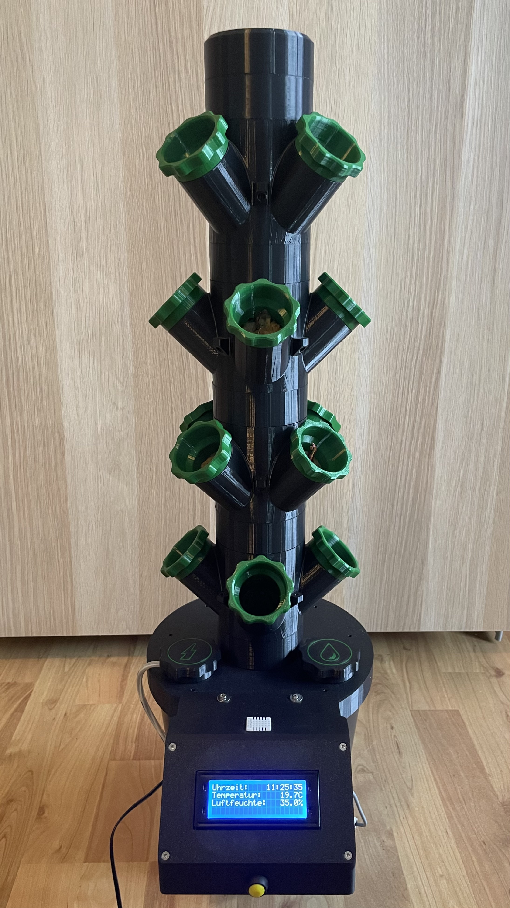

## 3D-Druck
**Grundaufbau:** 
Zunächst werden die benötigten, modularen Komponenten für den Hydroponikturm mit einem 3D-Drucker gedruckt. Als Basis für unser Projekt haben wir die Designs von Luitzor verwendet, die unter der folgenden URL verfügbar sind: [Luitzor's Hydroponic Tower Designs](https://www.thingiverse.com/thing:5712775). Wir empfehlen, diese Designs als Ausgangspunkt zu verwenden, da sie bereits sehr gut durchdacht, modular und funktional erweiterbar sind.

Wir haben die Designs auf 75 % der Originalgröße skaliert, da wir in unserem Fall einen kleineren Turm automatisieren wollten, der auch auf einem Schreibtisch, einer Fensterbank oder ähnlichen begrenzten Flächen Platz findet. Damit das Druckergebnis optimal wird, empfehlen wir die folgenden Druckeinstellungen:

- Material: Extrudr PET-G (lebensmittelecht)
- Drucker: Bambu Lab X1C 
- 0.16mm Optimal @BBL X1C mit folgenden Anpassungen:
    - Fülldichte: 25 % (Gyroid)

Mindestens sollten die folgenden Komponenten gedruckt werden:
- 1x 4-Way_Planting_Module_Hollow_Twist.STL
- 4x Standard_Pot_02_For_4-5-Way_Planting_Module.STL
- 1x Module_Spacer_40mm.STL
- 1x Dispenser_Module_Internal.STL
- 1x IKEA_Muskot_24cm_Lid.STL
- 1x Lid_Without_Holes.STL
- 1x Pump_Cap.STL
- 1x Pump_Cap_Symbol.STL
- 1x Filling_Cap.STL
- 1x Filling_Cap_Symbol.STL

Soll der Turm mehrere Ebenen haben, müssten Sie pro Ebene einmal `4-Way_Planting_Module_Hollow_Twist.STL`, viermal `Standard_Pot_02_For_4-5-Way_Planting_Module.STL` und einmal `Module_Spacer_40mm.STL` drucken. Der Abstandhalter `Module_Spacer_40mm.STL` ist nicht zwingend notwendig, aber wir empfehlen ihn, um den Pflanzen mehr Platz zum Wachsen zu geben. Außerdem empfehlen wir, mehrere Pflanzenpods `Standard_Pot_02_For_4-5-Way_Planting_Module.STL`, als Reserve zu drucken, falls eine Pflanze nicht gedeiht oder ersetzt werden muss.

Bei der Kombination der Abdeckkappen und der zugehörigen Symbole empfehlen wir, die Symbole mit einem Kleber auf die Kappen zu kleben oder, mit einem Drucker, der über ein AMS (Automatisches Materialwechselsystem) verfügt, die Symbole in einer anderen Farbe zu drucken, um eine bessere Sichtbarkeit zu gewährleisten.

**Unsere 3D Files**:
Zur sicheren Unterbringung der Elektronik, haben wir ein Gehäuse und Platinenhalterungen designed. Diese Dateien finden Sie im Ordner `3D_Designs`. Sie benötigen die folgenden Dateien jeweils einmal:
- Vertical_Gardening_Housing.stl
- Vertical_Gardening_Housing_Lid.stl
- Sockelhalter_Platine_Main.stl
- Sockelhalter_Relais.stl

**Kalkulation:** 
In der Datei `3D_Berechnung.xlsx` können Sie vorab kalkulieren, wie viel Filament für den Druck der benötigten Komponenten in Abhängigkeit zur Anzahl der Etagen und zu den empfohlenen Einstellungen gebraucht wird.

**Informationen zum Filament:**
Bei dem verwendeten Filament handelt es sich um lebensmittelechtes PET-G von Extrudr. Weitere Informationen zum Filament finden Sie hier in dem `Regulatorischen Datenblatt`: [Extrudr PET-G](https://www.extrudr.com/de/de/products/petg/).

Es sei noch darauf hingewiesen, dass PET-G im Vergleich zu PLA eine höhere Drucktemperatur benötigt und die Druckbetttemperatur ebenfalls höher eingestellt werden muss.

Anstelle des PET-G der Firma Extrudr kann auch anderes, lebensmittelechtes PET-G Filament verwendet werden. Es sollte jedoch auf entsprechende Zertifikate und Angaben des Herstellers geachtet werden, um sicherzustellen, dass das Filament für den Kontakt mit Lebensmitteln geeignet ist. 

Falls Sie sich mit dem Thema lebensmittelechtes Filament näher beschäftigen möchten, finden Sie hier einige weitere Informationen: 
- [Leitfaden für den lebensmittelechten 3D-Druck](https://formlabs.com/de/blog/leitfaden-lebensmittelechtheit-3d-druck/)
- [FDA-Bestimmungen, CFR 21](https://www.accessdata.fda.gov/scripts/cdrh/cfdocs/cfcfr/CFRSearch.cfm)
- [EU-Richtlinien 10/2011](https://eur-lex.europa.eu/legal-content/EN/ALL/?uri=CELEX%3A32011R0010)

## Elektronik
Die Automatisierung des Hydroponikturms umfasst die Erstellung einer Steuerplatine, die folgende Komponenten beinhaltet:

- Arduino Nano
- Display mit I2C Schnittstelle
- DHT22 Sensor (für Temperatur und Luftfeuchtigkeit)
- Schwimmerschalter (Wasserstandserkennung)
- Buck-Converter
- Relaismodul
- Pumpe
- RTC Modul

Eine detaillierte Stückliste mit Vorschlägen zu Anbietern ist in der Datei `Bauteilliste.xlsx` enthalten.

In der Bauteilliste ist auch eine Blanko-Platine aufgeführt. Wir haben im Rahmen unseres Projektes eine Lochrasterplatine entworfen, auf der die benötigten Komponenten verlötet wurden. Es steht Ihnen jedoch frei, ob Sie eine eigene Platine entwerfen oder eine Lochrasterplatine verwenden möchten.

Wir empfehlen die Erstellung einer Platine mit den Maßen (120 mm, 40 mm) um diese optimal in die vorgesehene 3D-gedruckte Halterung einzusetzen.

Sie benötigen außerdem noch folgendes Zubehör:
- Lötstation
- Lötzinn
- Schrumpfschlauch
- Kabelbinder
- Kabel

Anhand des [Schaltplans](Schaltplan.pdf) können Sie die Verdrahtung der einzelnen Komponenten nachvollziehen:
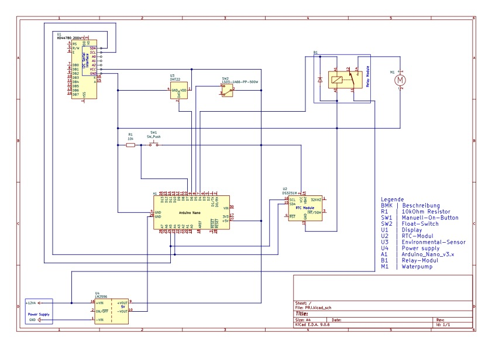

## Zusätzliches Zubehör
Um dem Hydroponikturm eine stabile und wasserdichte Basis zu geben, empfehlen wir die Verwendung eines passenden Topfs. In unserem Fall haben wir (anders als im Originaldesign von Luitzor) einen entsprechenden Topf im Baumarkt mit einem Außendurchmesser von 21,5cm gekauft, der sich mit einem gekauften Dichtungsband für Fenster und Türen, welches in den Deckel eingeklebt wird, abdichten lässt.
Der (auf 75% skalierte) Deckel hat einen Innendurchmesser von ca. 22cm, daher sollte der Topf einen Außendurchmesser haben, der etwas kleiner ist, damit der Deckel passt.

## Software
Der Quellcode für die Steuerung des Hydroponikturms ist in der Datei `Hydroponic_Tower_Automation.ino` enthalten. 

Die Software ist so konzipiert, dass sie die folgenden Funktionen erfüllt:
- Speicherung und Abruf von Einstellungen über das RTC-Modul
- Anzeige von Temperatur, Luftfeuchtigkeit und Wasserstand auf dem Display
- Steuerung der Pumpe basierend auf manuellen Eingaben und voreingestellten Zeitintervallen
- Alarmierung bei zu niedrigem Wasserstand und Verhindern des Pumpenbetriebs in diesem Fall

Sollten Sie andere Zeitintervalle, Bewässerungsdauern oder zusätzliche Funktionen benötigen, können Sie den Quellcode entsprechend anpassen.

Damit der Code kompiliert werden kann, benötigen Sie die folgenden Bibliotheken, die Sie über den Bibliotheksverwalter der Arduino IDE installieren können:
- RTClib von Adafruit (bei uns Version 2.1.4)
- LiquidCrystal_I2C von Martin Kubovčík, Frank de Brabander (bei uns Version 2.0.0)
- DHT sensor library von Adafruit (bei uns Version 1.4.6)

Spielen Sie den Code auf Ihren Arduino Nano, während Sie die Verdrahtung mit dem RTC-Modul gemäß dem Schaltplan verbunden haben, um die Uhrzeit einmalig einzustellen. Nach dem Schreiben der aktuellen Uhrzeit auf das RTC-Modul können Sie diesen Codeblock erneut auskommentieren, um die Uhrzeit nicht bei jedem Neustart zu überschreiben. Sobald die Uhrzeit eingestellt ist, ist das RTC-Modul in der Lage, die Zeit auch bei einem Stromausfall (der Hauptspannungsversorgung) zu behalten, da es über eine Knopfzellenbatterie weiterhin versorgt wird.

## Montage
Beginnen Sie mit dem Zusammenbau der 3D-gedruckten Komponenten gemäß der Anleitung von [Luitzor](https://www.thingiverse.com/thing:5712775). Dies sollte sehr intuitiv sein. 

Bauen Sie jeweils eine Baugruppe aus einem 4-Wege-Pflanzenmodul, vier Pflanzenpods und einem Abstandhalter zusammen. Wiederholen Sie diesen Schritt für die gewünschte Anzahl an Etagen. Nun beginnen Sie mit dem Dispenser-Modul, an das nun der Wasserschlauch angeschlossen wird.

Im Anschluss nehmen Sie die zuvor erstellten Baugruppen und stapeln diese auf das Dispenser-Modul. Der Wasserschlauch wird durch die runden Ausschnitte in allen Modulen hindurchgeführt.  

Achten Sie darauf, dass die Module korrekt ausgerichtet sind, damit die Pflanzenpods später nicht direkt untereinander, sondern um 45 Grad versetzt, eingesetzt werden können.

Der Deckel des Topfs wird ebenfalls bestückt mit den Abdeckungen für die Pumpe und dem Zugang zum Wassertank. In der Mitte des Deckels wird der Turm aufgeschraubt.

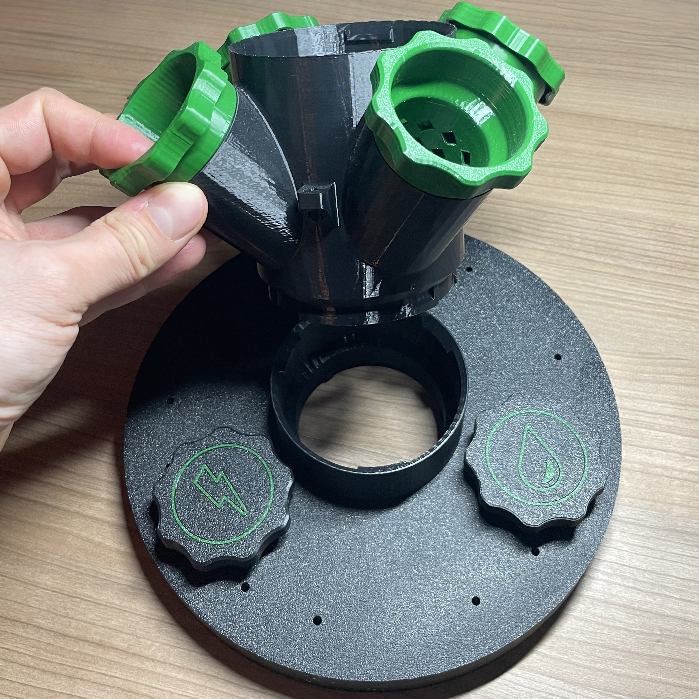

In den Topf wird ein entsprechendes Loch für den Schwimmerschalter gebohrt, der dann von außen in den Topf eingesetzt und mit einer Mutter befestigt wird. Achten Sie darauf, dass der Sensor wasserdicht im Topf sitzt, damit kein Wasser austreten kann.

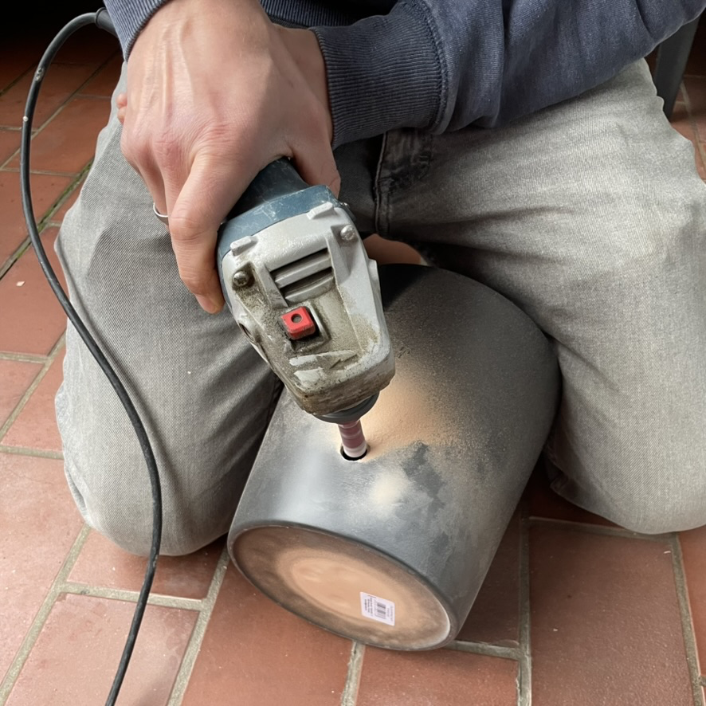

Anschließend erhitzen Sie vier M3 Einschmelzgewinde (mit einer Länge von ca. 6 mm) und setzen diese in das Gehäuse zur Befestigung des Deckels ein.

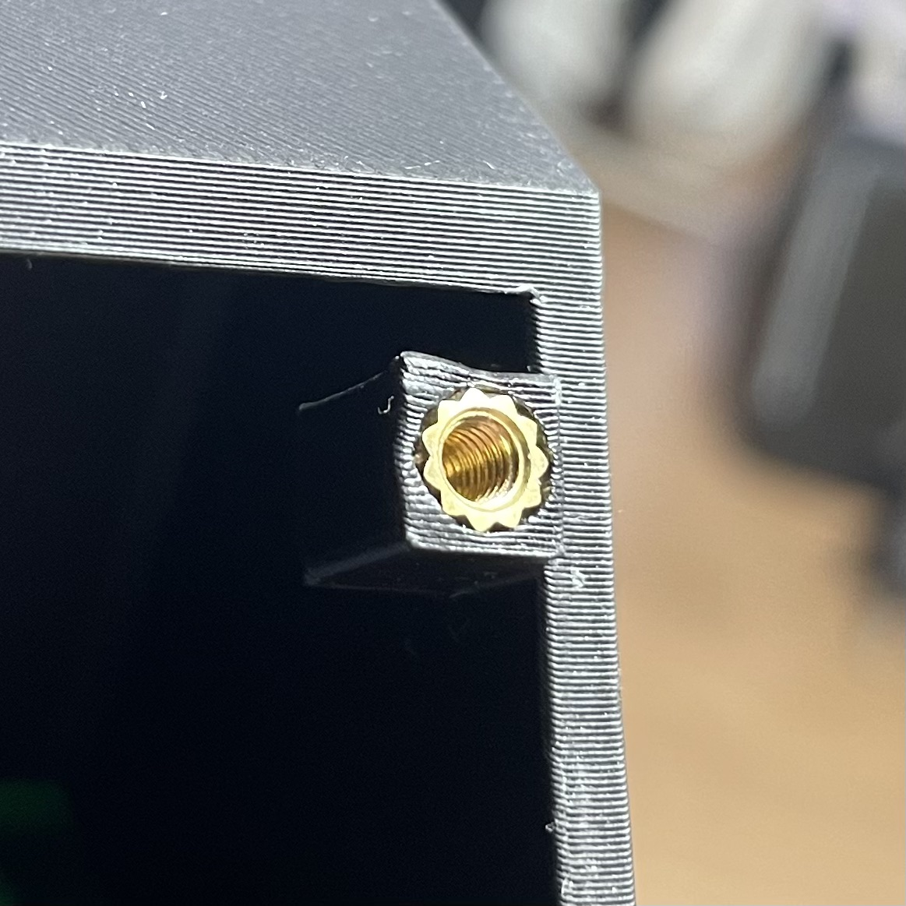

Außerdem verkleben Sie die Hauptplatinenhalterung und den DHT22 im Gehäuse mit einem geeigneten Kleber (z. B. Zweikomponentenkleber).
Achten Sie darauf, die Platinenhalterung so zu positionieren, dass der Anschluss für die Spannungsversorgung der Platine durch die Aussparung im Gehäuse passt.

Die Platinenhalterung für das Relaismodul wird lediglich mit zwei M2,5 Schrauben (Länge maximal 4,5 mm) befestigt. Das RTC-Modul wird in dem Gehäuse an dem dafür vorgesehenen Platz mit drei M2,5 Schrauben (Länge maximal 6 mm) angebracht. 
Beachten Sie, dass zu lange Schrauben das Gehäuse beschädigen können.
Den Taster zum Aktivieren des manuellen Pumpenbetriebs können Sie an der Vorderseite des Gehäuses in dem entsprechenden Ausschnitt anbringen und ihn mit der mitgelieferten Mutter befestigen.

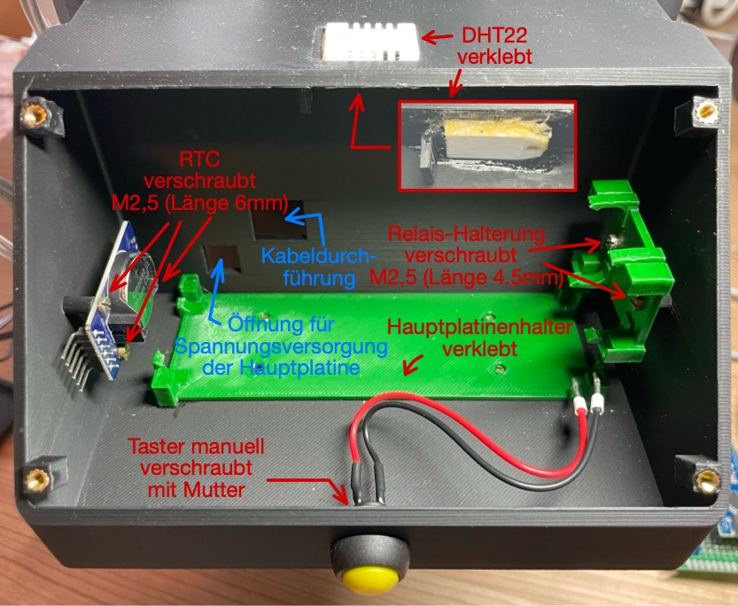

In den Deckel des Gehäuses wird das Display mit vier M2,5 Schrauben (Länge maximal 4,5 mm) befestigt.
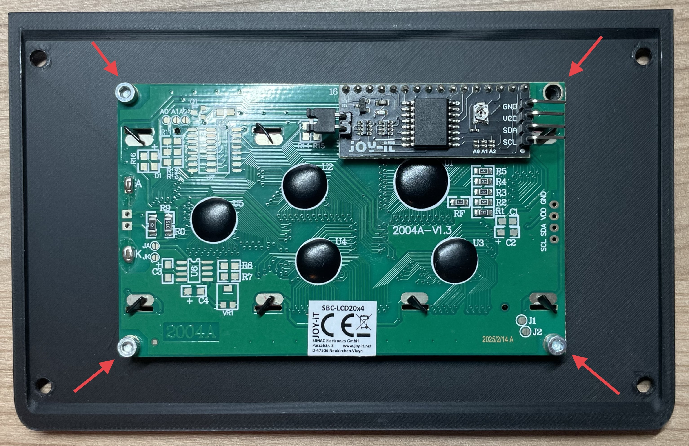

Im Anschluss verlöten Sie die Elektronikkomponenten, die auf der Hautplatine Platz finden sollen gemäß dem [Schaltplan](Schaltplan.pdf).
Sinnvoll ist es die Verbindungen zu den einzelnen externen Komponenten über Schraubverbindungen herzustellen, damit diese bei Bedarf einfach getauscht werden können. 

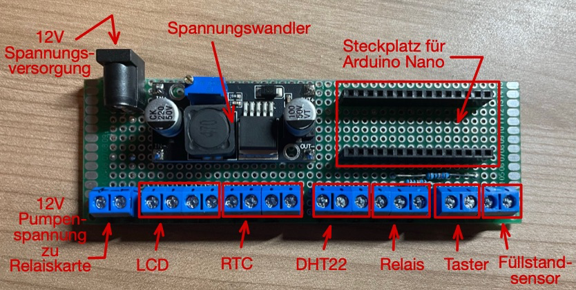

Die Verkabelung der einzelnen Komponenten im Gehäuse erfolgt ebenfalls gemäß dem [Schaltplan](Schaltplan.pdf). Achten Sie darauf, dass die Kabel ausreichend lang sind, um alle Komponenten zu erreichen. Sinnvoll ist es, die Kabel mit Schrumpfschlauch zu isolieren und entsprechende Aderendhülsen zu verwenden.

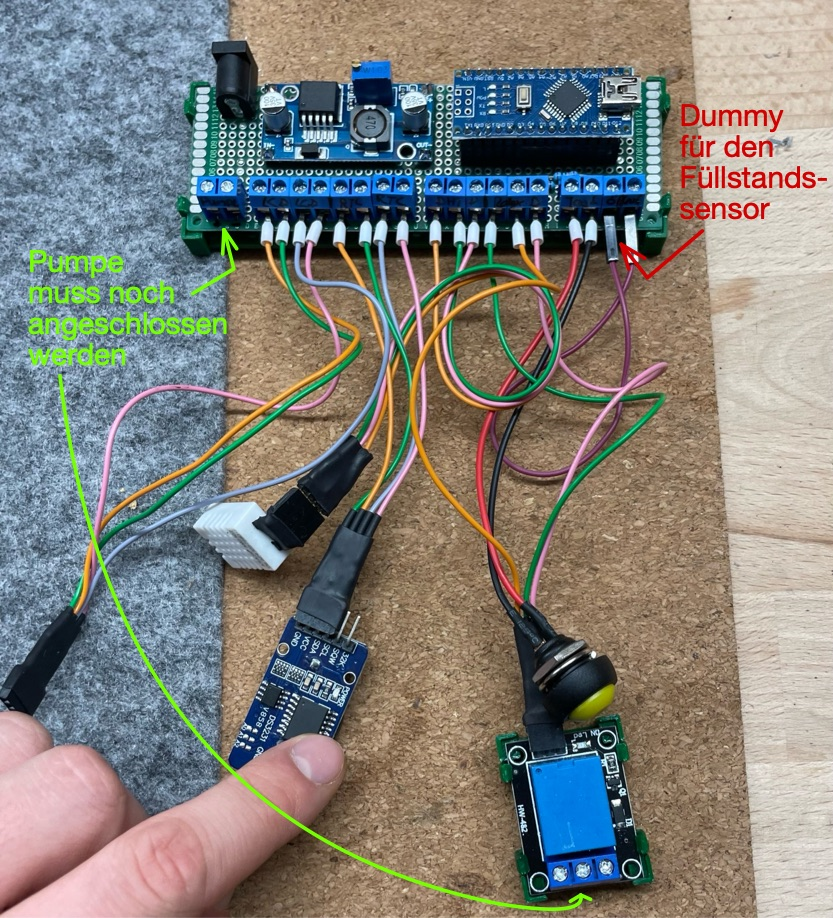

Bevor die Pumpe in den Topf eingesetzt wird, wird sie mit einem Stück Fliegengitter vor Verunreinigungen geschützt. Das Fliegengitter wird mit einem Kabelbinder an der Pumpe befestigt. 

Anschließend wird die Pumpe durch den dafür vorgesehenen Ausschnitt im Deckel des Topfs eingesetzt und mit der Platine entsprechend des Schaltplans verbunden. Das Kabel der Pumpe sollte durch die Aussparung an der Rückseite des Gehäuses geführt werden, damit dieses später geschlossen werden kann.

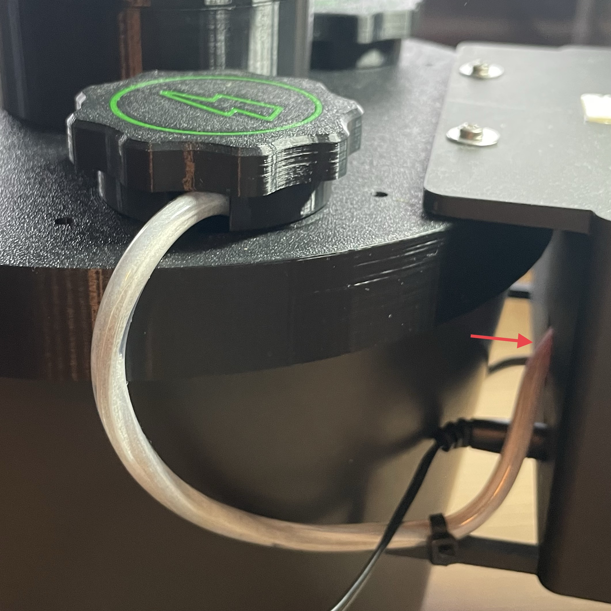

Im Anschluss wird nun der finale Feinschliff der Verkabelung durchgeführt. Die Kabel sollten so verlegt werden, dass sie nicht im Weg sind und anschließend vorsichtig mit Kabelbindern fixiert und gebündelt werden. 
Sie können überschüssige Kabellängen kürzen oder aufrollen, um eine ordentliche Verkabelung zu gewährleisten.
Achten Sie darauf, dass Sie keine Kabel quetschen, wenn Sie die Kabelbinder fest ziehen.

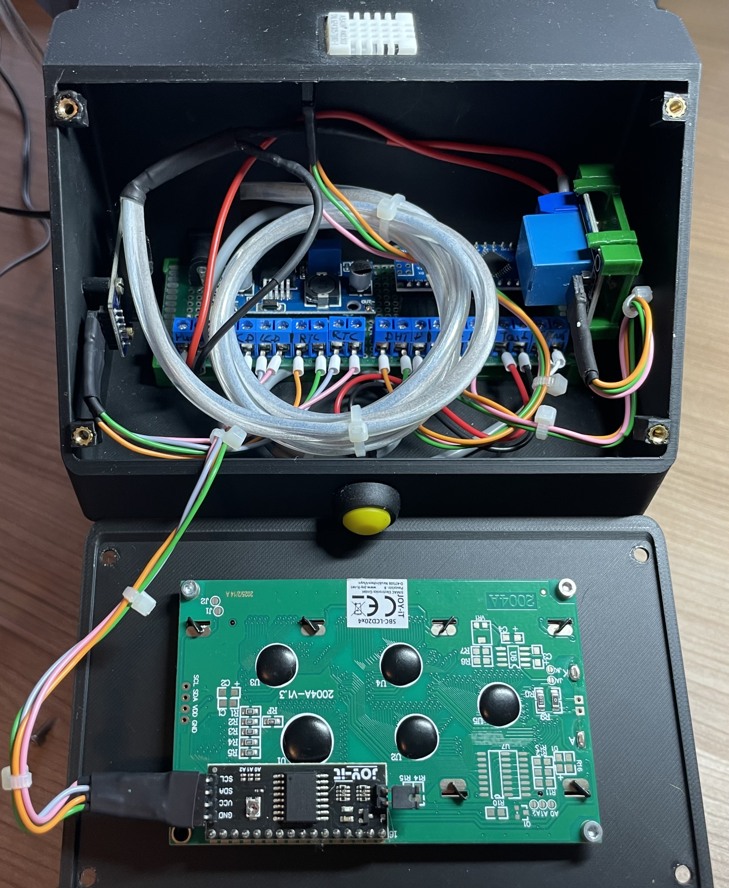

Nun können Sie das Elektronikgehäuse mit vier M3 Senkkopfschrauben (empfohlene Länge 10 mm) verschließen (Deckel und Gehäuse verbinden).
Achten Sie darauf, dass keine Kabel gequetscht werden, wenn das Gehäuse geschlossen wird.

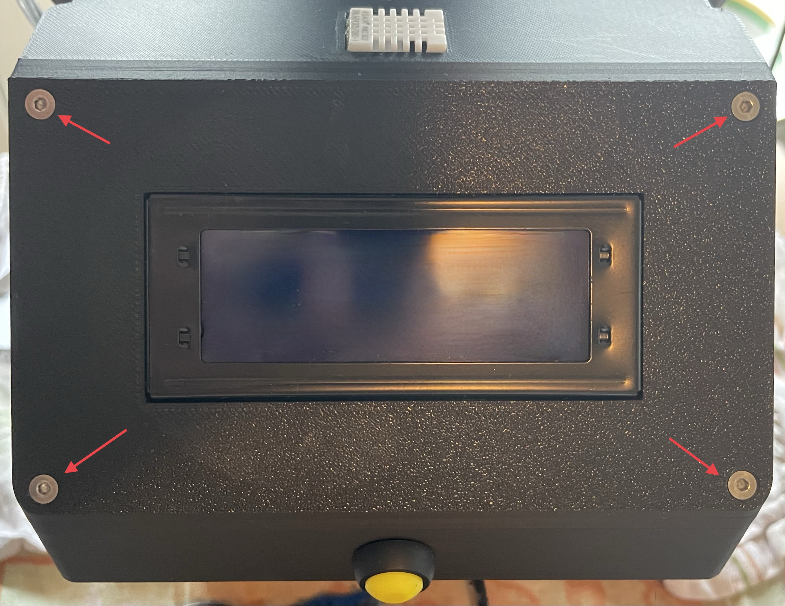

Im Anschluss wird das verschlossene Gehäuse auf dem Topfdeckel mit zwei M3 Schrauben (empfohlene Länge 15 mm), sowie zwei (oder vier) M3 Muttern befestigt. Verwenden Sie dazu die Langlöcher des Gehäuses und die Löcher im Topfdeckel, die Luitzor für die Befestigung von LED-Trägern vorgesehen hat.

Idealerweise sollten Sie M3 Karosseriescheiben verwenden, um eine bessere Lastverteilung auf den Langlöchern des Gehäuses zu gewährleisten und bei der Befestigung zwei weitere Muttern verwenden und diese gegeneinander festzuziehen, um ein Lösen der Schrauben zu verhindern.

Sicht von oben:
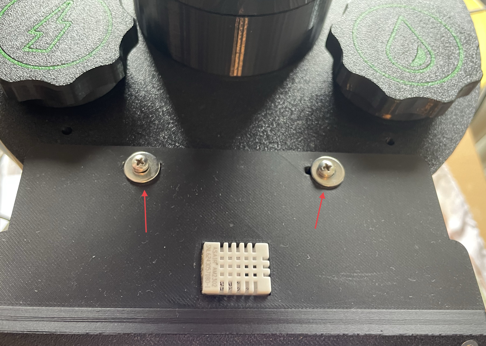
Sicht von unten:
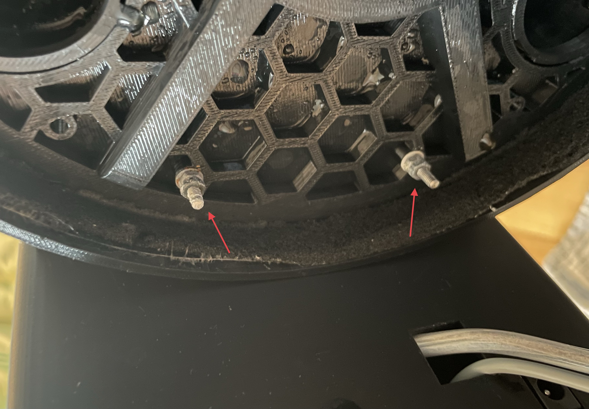

Achten Sie darauf, dass Sie für die Schrauben und Muttern Edelstahl oder verzinkte Alternativen verwenden, um Korrosion durch die Nähe zum Wasser zu vermeiden.

## Anzüchten von Pflanzen
Im Verlauf unseres Projekts haben wir verschiedene Varianten der Pflanzenanzucht ausgetestet. Im Folgenden beschreiben wir zwei Möglichkeiten, wie Sie die Pflanzen für den Hydroponikturm ziehen können.

Allgemein wird zwischen Licht- und Dunkelkeimern unterschieden. Dementsprechend sollten Sie sich vorab informieren, ob die von Ihnen gewünschten Pflanzen Licht- oder Dunkelkeimer sind, um die Keimbedingungen entsprechend anzupassen.

Eine Möglichkeit ist es, die Samen in feuchtem Küchenpapier oder Watte anzuzüchten. Legen Sie die Samen dazu zwischen zwei feuchte Lagen und halten Sie diese stets feucht. Achten Sie darauf, dass die Samen nicht zu nass liegen, da sie sonst faulen können. Stellen Sie die Samen an einen warmen Ort mit ausreichend Licht (je nach Keimertyp) und warten Sie, bis die Samen keimen. 
Beachten Sie außerdem, dass es je nach Pflanze unterschiedlich lange dauern kann, bis die Samen keimen.

Nach dem Keimen können die kleinen Pflanzen vorsichtig in befeuchtete Steinwollwürfel gepflanzt werden. Diese werden zuvor in die Pods des Hydroponikturms eingesetzt. Achten Sie dabei darauf, die Wurzeln nicht zu beschädigen. 

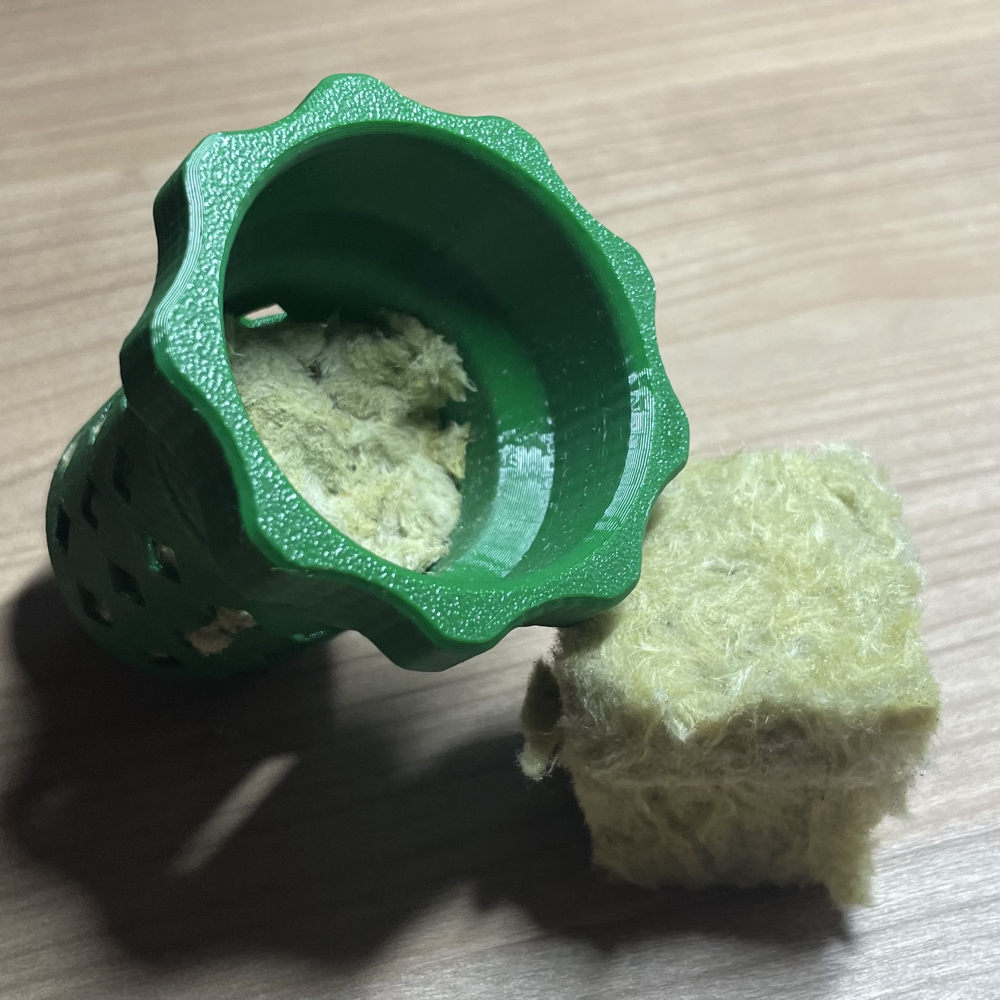

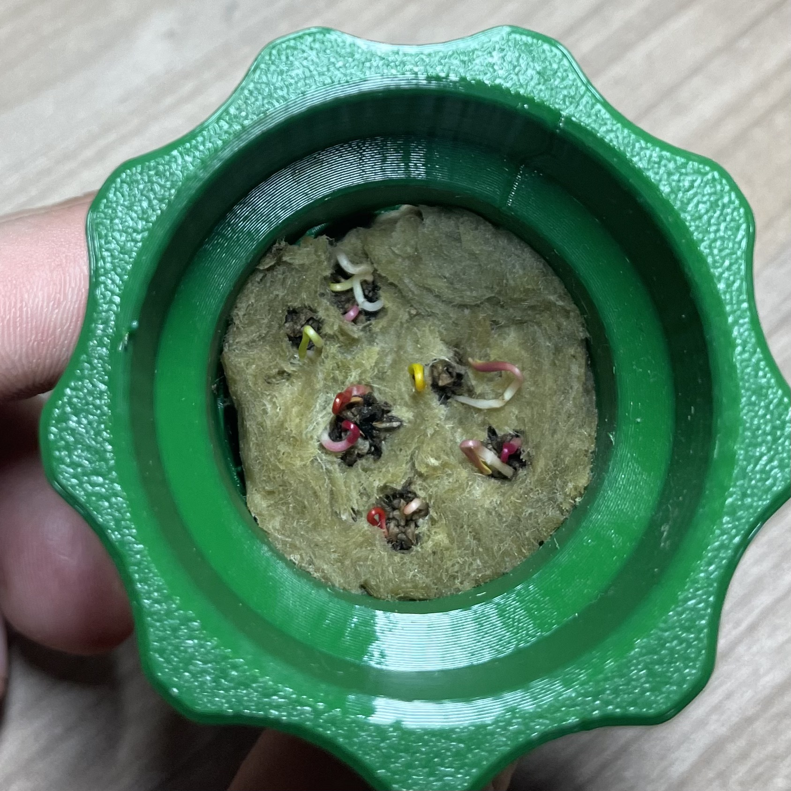

Eine weitere Möglichkeit ist die Anzucht der Pflanzen direkt in den (herausgenommenen) Pods des Hydroponikturms. Füllen Sie die Pods dazu mit feuchter Steinwolle und pflanzen Sie die Samen direkt hinein. Halten Sie das Substrat stets feucht, aber nicht zu nass, und stellen Sie die Pods an einen warmen Ort mit ausreichend Licht (je nach Keimertyp).

Beachten Sie außerdem, dass einige Pflanzen spezielle Anforderungen an die Nährlösungen, den pH-Wert des Wassers und die Lichteinstrahlung haben. Informieren Sie sich daher vorab über die Bedürfnisse der von Ihnen gewünschten Pflanzen, um optimale Wachstumsbedingungen zu gewährleisten.

----
*In Kürze wird hier noch ein weiteres Kapitel eingefügt. Es folgt ein kleiner Teaser.*  

Aktuell testen wir eine weitere Methode, um Pflanzen mit ausgeprägten Wasserwurzeln heranzuziehen. Dafür werden die Pflanzen bereits sehr früh beinahe vollständig mit den Wurzeln in ein Wassergefäß gesetzt, um sie dann nach einer Weile in den Turm umzusetzen.

Zunächst werden die Samen in einer entsprechenden Anzuchtschale mit einem sehr kleinen Steinwollwürfel angezogen.
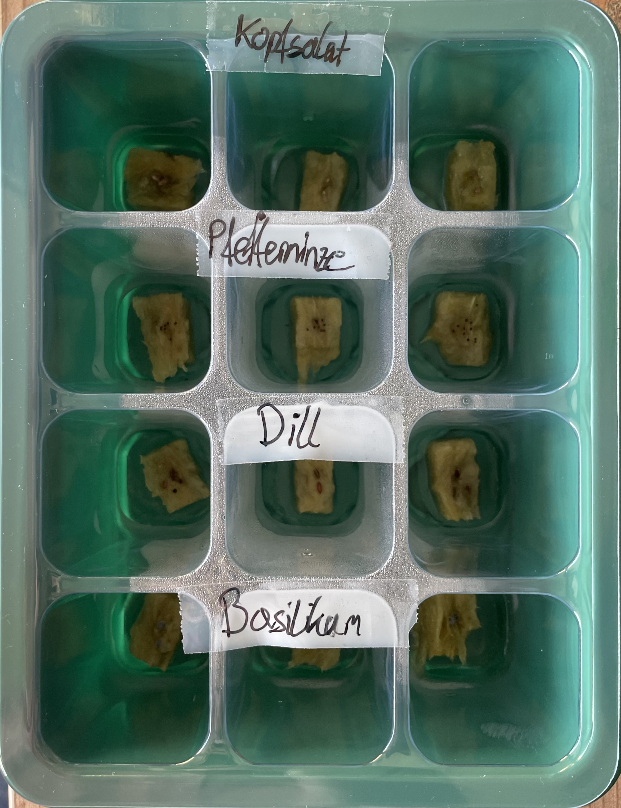

Die Anzuchtschale wird mit einer durchsichtigen Haube abgedeckt, um eine hohe Luftfeuchtigkeit zu gewährleisten. Über einen Schlitz in der Haube kann die Luftzirkulation reguliert werden.

Zu beachten ist auch an dieser Stelle, dass die Samen je nach Pflanzenart unterschiedliche Anforderungen an Licht und Temperatur haben. Informieren Sie sich daher vorab über die Bedürfnisse der von Ihnen gewünschten Pflanzen, um optimale Wachstumsbedingungen zu gewährleisten.

Nachdem die Pflanzen gekeimt sind und die Wurzeln eine gewisse Länge erreicht haben, wird die Steinwolle hälftig aufgeschnitten und die Pflanze mitsamt der Wurzeln so in die Steinwolle gesetzt, dass die Wurzeln in das Wassergefäß hineinragen. Nun ...

----

## Inbetriebnahme
Schließen Sie die Stromversorgung an das Gehäuse an. Das Display sollte nun aufleuchten und die aktuellen Messwerte anzeigen, sowie eine Meldung, dass der Wasserstand zu gering ist.

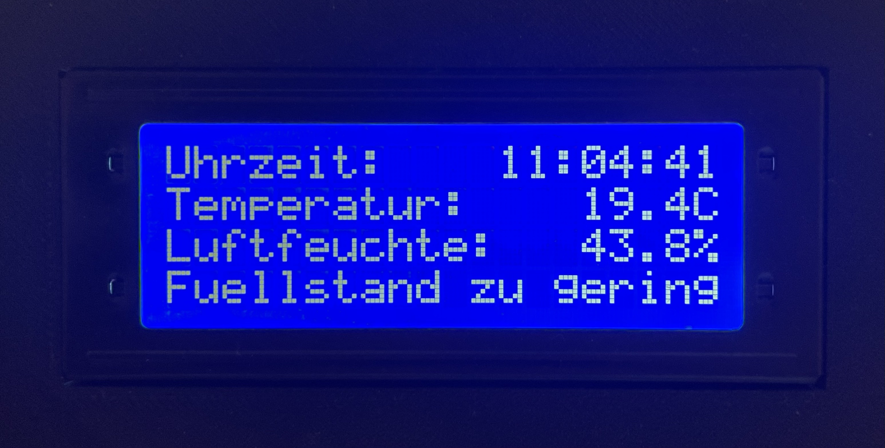

Füllen Sie den Topf mit Wasser und ggf. einer Nährstofflösung auf. Die Wasserstandsanzeige auf dem Display sollte sich entsprechend aktualisieren.

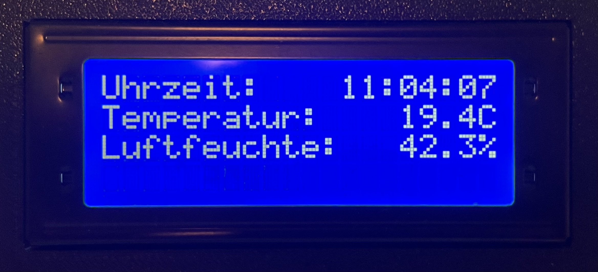

Stellen Sie sicher, dass die Pumpe korrekt mit dem Wasserschlauch verbunden ist, der in den Hydroponikturm führt, und der Turm keinerlei Undichtigkeiten aufweist.
Drücken Sie den Taster, um die Pumpe manuell zu starten, und überprüfen Sie, ob die Pumpe ordnungsgemäß funktioniert und Wasser durch den Hydroponikturm pumpt, welches von oben nach unten tropfen sollte.

Sollten Sie Probleme mit Undichtigkeiten der Bajonettverbindungen der Module haben, können Sie diese mit einem geeigneten Teflonband abdichten.

Ist die Funktionstüchtigkeit und Dichtigkeit des Systems bestätigt, so können Sie die ersten Pflanzen in den Hydroponikturm einsetzen oder dort anziehen.

Ihr neues, automatisiertes Hydroponiksystem ist nun betriebsbereit! Wir wünschen Ihnen viel Erfolg und Freude beim Anbau Ihrer Pflanzen.

## Warnungen
- Achten Sie darauf, dass alle elektronischen Komponenten vor Wasser geschützt sind, um Kurzschlüsse zu vermeiden.
- Verwenden Sie nur lebensmittelechte Materialien für alle Teile, die mit Wasser und Pflanzen in Kontakt kommen.
- Stellen Sie sicher, dass die Pumpe für den Dauerbetrieb geeignet ist und nicht überhitzt.
- Führen sie nur Arbeiten durch, die Sie sicher beherrschen und die Sie durchführen dürfen. Andernfalls ziehen Sie einen Fachmann hinzu.

## Anregungen 
Im Folgenden haben wir Ihnen einige Ideen zusammengestellt, wie Sie das Projekt erweitern oder anpassen können:
- Integration eines pH- und EC-Sensors zur Überwachung der Nährlösung
- Automatische Auffüllung des Wassertanks bei niedrigem Wasserstand
- Automatisierte Nachfüllung der Nährlösung in den Topf
- Steuerung der Beleuchtung für optimales Pflanzenwachstum
- Mobile App zur Fernüberwachung und Steuerung des Systems um Parameter, wie die Bewässerungszeit anzupassen (ggf. Verwendung eines WLAN-Moduls oder eines ESP32 statt des Arduino Nano)
- Erweiterung des Systems um eine automatische Belüftung der Pflanzen
- Integration von Kameras zur Überwachung des Pflanzenwachstums
- Anpassung der Bewässerung des Systems basierend auf Feuchtigkeitsmessungen in der Steinwolle
- Datenspeicherung und Analyse der Wachstumsbedingungen zur Optimierung des Pflanzenanbaus
- Pufferung des Betriebs bei Stromausfällen durch eine Batterie